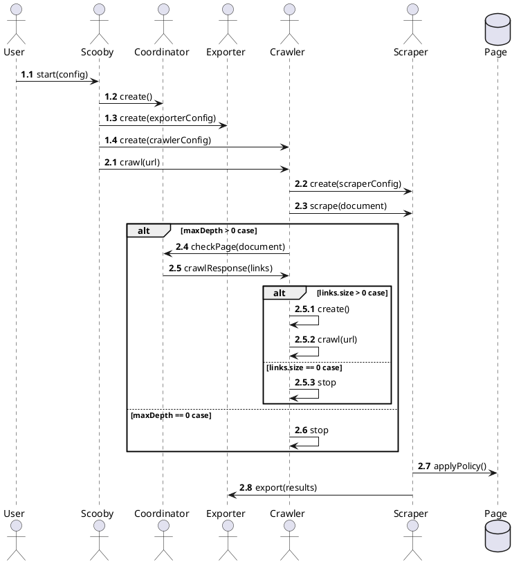

# Application UML

```plantuml

@startuml

actor User as user order 10
actor Scooby as scooby order 20
actor Coordinator as coordinator order 30
actor Exporter as exporter order 40
actor Crawler as crawler order 50
actor Scraper as scraper order 60

database Page as page order 70

autonumber 1.1

user -> scooby : start(config)

scooby -> coordinator : create()
scooby -> exporter : create(exporterConfig)
scooby -> crawler : create(crawlerConfig)

autonumber inc A

scooby -> crawler : crawl(url)

crawler -> scraper : create(scraperConfig)

crawler -> scraper : scrape(document)

alt maxDepth > 0 case

    crawler -> coordinator : checkPage(document)
    coordinator -> crawler : crawlResponse(links)
    
    alt links.size > 0 case
    
        autonumber 2.5.1
        
        crawler -> crawler : create()
        crawler -> crawler : crawl(url)
    
    else links.size == 0 case
    
        crawler -> crawler : stop
        
    end

else maxDepth == 0 case
    autonumber 2.6
    crawler -> crawler : stop
    
end

scraper -> page : applyPolicy()
scraper -> exporter : export(results)

@enduml

```