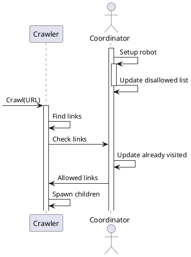
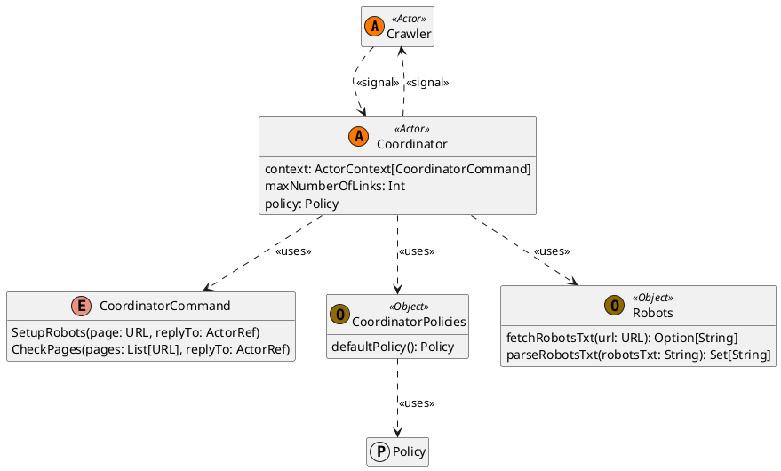

# Coordinator
The **Coordinator** is an actor that validates the URLs found by Crawlers. 
The checks are based on a set of rules defined by the user, defining a policy that dictates which URLs are valid and which are not. 
Coordinators also control if a URL was already visited by a crawler and if it's allowed by the robot.txt file of the website.

## Structure

## Robots.txt
When undertaking web scraping, it is crucial to consider the robots.txt file associated with the domain under analysis. 
This file contains directives that specify which paths are permissible or restricted for various web crawlers.