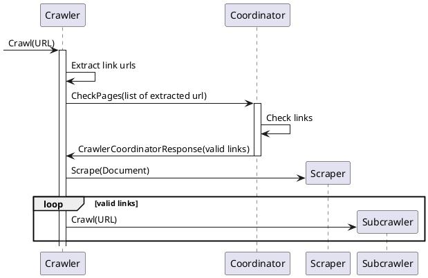
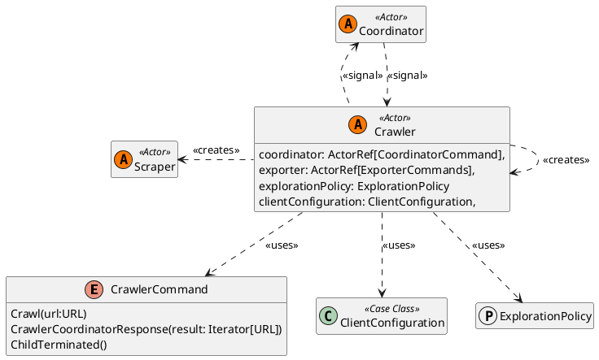

# Crawler

A **Crawler** is a system entity responsible for searching explorable links inside a web page. It interacts with the 
[Coordinator](Coordinator.md) to validate the found urls and is responsible for creating scrapers, for extracting data from a page
and new crawlers exploring new urls.

We can summarize the interaction between the Crawler and the other components with the following:

Each time a Crawler found a new valid url it spawns a new child crawler that will analyze it. When the analysis of the page 
is complete, a crawler will continue to signal it to the parent, then when a crawler no longer has an active child
it's removed from the system.

## Structure

