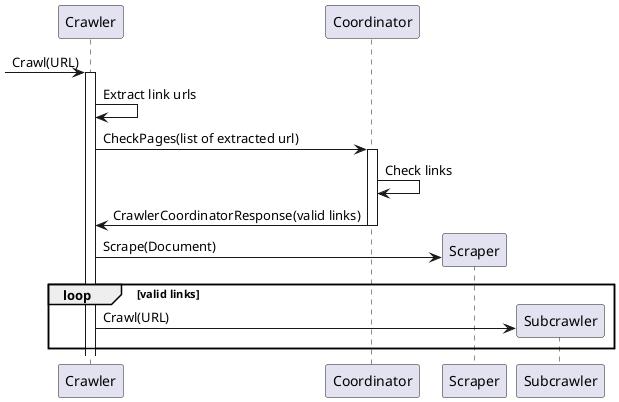
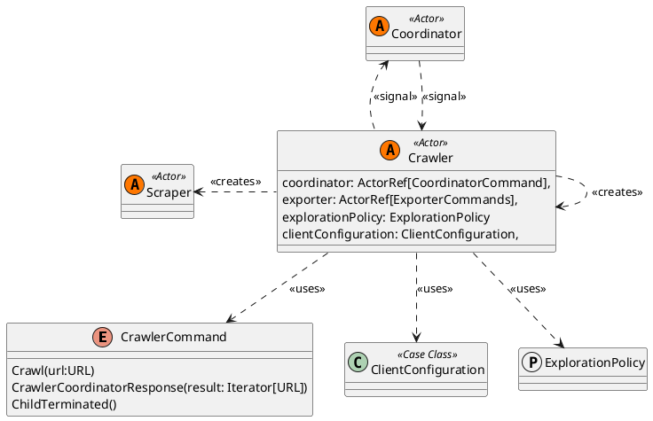

# Crawler

A Crawler is a system entity responsible for searching explorable links inside a web page. It interacts with the 
coordinator to validate the found urls and is responsible for creating scrapers, for extracting data from a page, 
and new crawlers to continue analysing the website.

We can summarize the interaction between the Crawler and the other components with the following:


## Structure



## Exploration Policy

An Exploration Policy describe the way crawlers fetch links from a page. It's represented by a function that receive as input a
HTML Document (Crawl Document) and that returns an iterable of URLs.

As example, we can describe an exploration policy that only fetch same domain urls:

```Scala
def sameDomainLinks: ExplorationPolicy = (document: CrawlDocument) =>
    document.frontier.filter(_.domain == document.url.domain)
```
It's important to note that all crawlers will assume the same exploration policy inside the system and that should be configured
at application startup.
