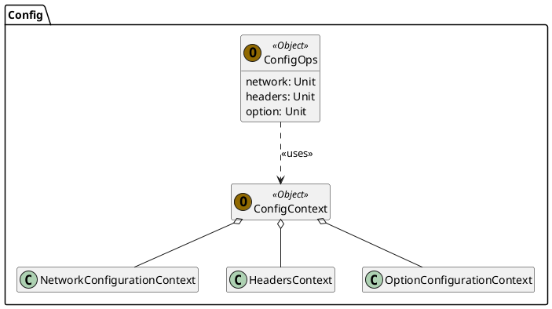

# DSL

A Domain-Specific Language (DSL) has been developed as an alternative to a standard API for configuring the application.

Adhering to design principles, the DSL is implemented **on top of the existing, functional API**. This ensures that the
system remains _independent_ of the DSL's design and implementation.

The DSL is organized into modules, each representing a different aspect of the application's configuration. There are
four modules: Config, Crawl, Scrape, and Export. Each module is divided into two parts: `Context` and `Ops`.

Here is an example within the Config module:



`Contexts` represent the **scopes** within the DSL. For instance, in the following snippet:

```Scala
scooby:
    scrape:
        elements
```

Both `scooby` and `scrape` define `Contexts`.

`Ops`, on the other hand, are the **"keywords"** of the language. In the above snippet, all three
words (`scooby`, `scrape`, and `elements`) are considered `Ops`.

This design allows the restriction of valid `Ops` to specific `Contexts`. The actual mechanism to enforce this is an
implementation detail.

## Language Specification

The primary part of the DSL specification is represented in the following EBNF code snippet:

**Note:** Since the language is implemented as an _internal_ DSL, there are many valid programs beyond this
specification. Thus, the provided specification is only partial.

```BNF
program ::= scooby_block ;

scooby_block ::= "scooby:" config_block? crawl_block scrape_block? exports_block? ;

config_block ::= "config:" network_block? option_block? ;
network_block ::= "network:" network_setting+ ;
network_setting ::= "NetworkTimeout is" time
                  | "MaxRequests is" number
                  | "headers:" header_setting+ ;
header_setting ::= string "to" string ;
option_block ::= "option:" option_setting+ ;
option_setting ::= "MaxDepth is" number
                 | "MaxLinks is" number ;

crawl_block ::= "crawl:" url_block policy_block? ;
url_block ::= "url:" string ;
policy_block ::= "policy:" policy_type ;
policy_type ::= ("hyperlinks" | "allLinks") not_external? ;
not_external ::= "not external" ;

scrape_block ::= "scrape:" element_selection ;
element_selection ::= "elements"
                    | "elements that" condition
                    | "elements that:" condition_block ;

condition ::= "(" condition_expr ")" ;
condition_expr ::= simple_condition ( "and" simple_condition )* ;
simple_condition ::= "haveTag(" string ")"
                   | "haveClass(" string ")"
                   | "haveId(" string ")"
                   | "haveAttribute(" string ")"
                   | "haveAttributeValue(" string ")"
                   | "followRule" "{" rule "}" ;
condition_block ::= rule_condition ( "and" rule_condition )* ;
rule_condition ::= "followRule" "{" rule "}" ;

rule ::= "element" element_expr ;

element_expr ::= ".attr(" string ") == " string
               | ".text == " string
               | ".tag == " string
               | ".id == " string
               | ".parent" element_expr ;

exports_block ::= "exports:" export_type_block+ ;
export_type_block ::= "batch:" batch_strategy_block aggregate_block?
                    | "streaming:" result_strategy ;
batch_strategy_block ::= "strategy:" result_strategy ;

result_strategy ::= result_expr output_destination ;
result_expr ::= "results" ( "get" elem_property )? ;
elem_property ::= "tag" | "id" | "attr(" string ")" | "text" | "outerHtml" ;
aggregate_block ::= "aggregate:" aggregation ;
aggregation ::= "_ ++ _"
output_destination ::= "toFile(" string ")" "withFormat" format
                     | "toConsole" "withFormat" format ;
format ::= "json" | "text" ;

time ::= number "." unit ;
unit ::= "seconds" ;
number ::= [0-9]+ ;
string ::= "\"" [^\"]* "\"" ;

```

## Examples of Usage

Here are some examples of valid programs written in this DSL.

### Example 1: Full Settings Provided

This snippet demonstrates the use of all available settings, providing a comprehensive example of a Scooby DSL program.

```Scala
scooby:
    config:
        network:
            NetworkTimeout is 5.seconds
            MaxRequests is 100
            headers:
                "User-Agent" to "Scooby/1.0"
        option:
            MaxDepth is 2
            MaxLinks is 100
            
    crawl:
        url:
            "https://www.example.com/"
        policy:
            hyperlinks not external
            
    scrape: 
        elements
        
    exports:
        batch:
            strategy:
                results get tag output:
                    toFile("test.json") withFormat json
            aggregate:
                _ ++ _
```

This program is designed to crawl the URL `"https://www.example.com/"`, recursively visiting all found _hyperlinks_ that
do not redirect to external domains.

For each page, all HTML elements are scraped and their HTML tags are exported to a file named `test.json` in JSON
format.

### Example 2: Scrape and Export

This snippet includes only the `scrape` and `exports` sections, as well as the mandatory `crawl` section to set the root
URL.

```Scala
scooby:
    crawl:
        url:
            "https://www.example.com/"
    scrape:
        elements that (haveTag("a") and haveClass("gorgeous"))
    exports:
        streaming:
            results output:
                toConsole withFormat text
```

This program is designed to crawl the URL `"https://www.example.com/"`, recursively visiting all found _hyperlinks_ (
default behavior).

For each page crawled, the scraping will focus only on HTML elements with the tag `"a"` and the class
attribute `"gorgeous"`. Each of these elements' outer HTML will be exported in text format and printed to the console.

### Example 3: More Advanced

This snippet uses the DSL in a more advanced and less "pure" form, fully leveraging the advantages of an internal
implementation.

```Scala
scooby:
    crawl:
      url:
        "https://www.example.com"
      policy:
        allLinks that (((url: URL) => url.isRelative) and 
            (_.toString.endsWith("example")))
        
    scrape:
      elements that:
        followRule { element.parent.text.nonEmpty } and
          followRule { element.attr("alt").nonEmpty }

    exports:
      batch:
        strategy:
          results.groupMapReduce(_.tag)(_ => 1)(_ + _) output:
            toFile("test.json") withFormat json

        aggregate:
          _ ++ _
```

This program crawls the URL `"https://www.example.com/"`, recursively visiting all _links_ that are **relative URLs**
and whose text ends with "example".

For each page crawled, the scraping focuses on HTML elements whose parent's text is not empty and that contain a
non-empty "alt" attribute.

The export process outputs key-value pairs to a file named `test.json` in JSON format, where the keys are the HTML tags
of the scraped elements and the values are the number of occurrences of each tag.