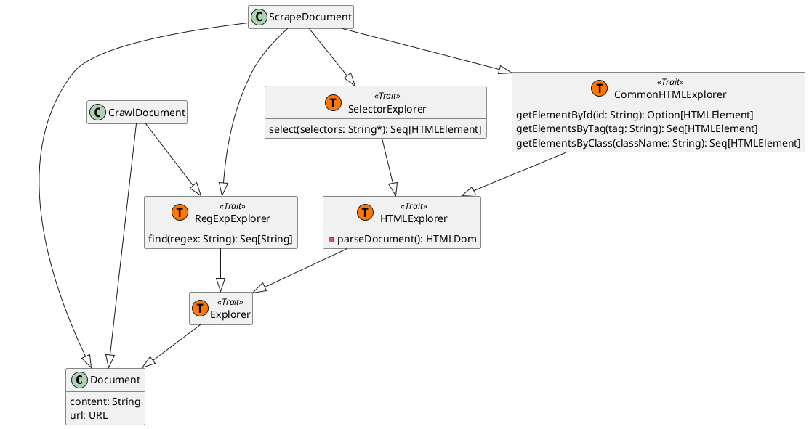
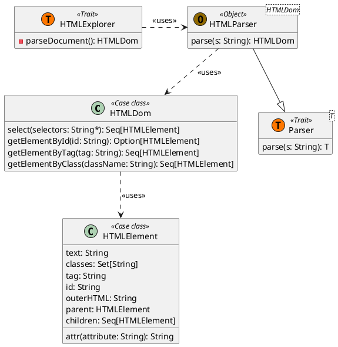

# Document library

As the Scooby application needs to constantly manage HTML documents and links inside a webpage, an abstraction for these
kind of concepts is needed.

To this regard, we developed a **Document library** that encapsulates all that is needed of HTML documents and so on.

## Structure

As we can see, this library has been designed taking Scala Traits mechanism into consideration: their modularity and
composability allowed to separate Document capabilities in a very fine-grained manner.

Here we use what we've called **Explorers** in order to define what we can get from a Document's content. In relation to
the kind of usage, not all types of Documents need all capabilities. For example, we crawl a webpage, we are more 
interested in finding hyperlinks, better that using HTML selectors: in fact, `CrawlDocument` doesn't need the 
`SelectorExplorer`. 

There a hierarchy also between Explorers: both `CommonHTMLExplorer` and `SelectorExplorer` need to access a HTML document
under the hood, that needs to be parsed from the Document's string. For this reason, we defined a `HTMLExplorer` that 
lazily parses a Document's content into HTML, and makes it available to the other Explorers that extends it (not outside,
as it's private)

## HTML library

To make the interaction and parsing of HTML content easier, a small HTML library has been designed. This library is 
mainly used by the Explorers (particularly, `CommonHTMLExplorer`).

