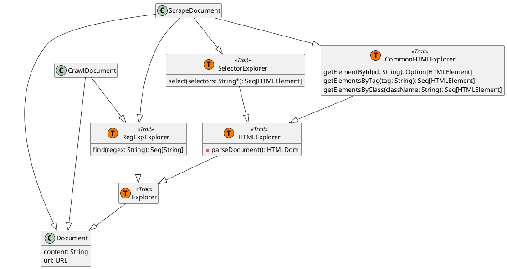
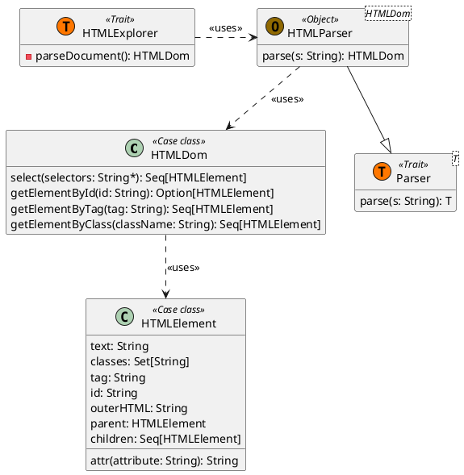

# Document Library

Since the Scooby application needs to continuously manage HTML documents and links within webpages, an abstraction for
these concepts is necessary.

To address this, we developed a **Document Library** that encapsulates everything needed to handle HTML documents.

## Structure

This library is designed with Scala Traits in mind, leveraging their modularity and composability to separate document
capabilities in a very fine-grained manner.

We use what we call **Explorers** to define the capabilities for extracting information from a document's content.
Depending on the use case, not all document types require all capabilities. For instance, when crawling a webpage, the
primary interest is in finding hyperlinks rather than using HTML selectors, hence `CrawlDocument` does not require
the `SelectorExplorer`.

There is also a hierarchy among the Explorers: both `CommonHTMLExplorer` and `SelectorExplorer` need to access an HTML
document internally, which requires parsing the document's string content. Therefore, we defined an `HTMLExplorer` that
lazily parses a document's content into HTML and makes it available to the other Explorers that extend it (keeping it
private to maintain encapsulation).

## HTML Library

To facilitate the interaction and parsing of HTML content, we designed a small HTML library. This library is mainly
utilized by the Explorers (particularly the `CommonHTMLExplorer`).

