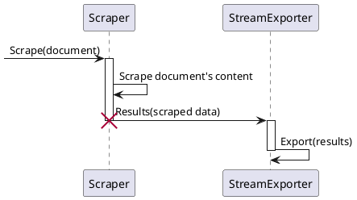
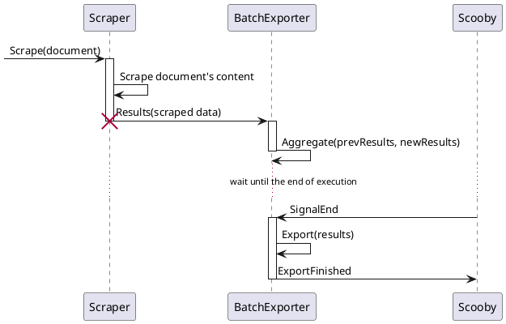
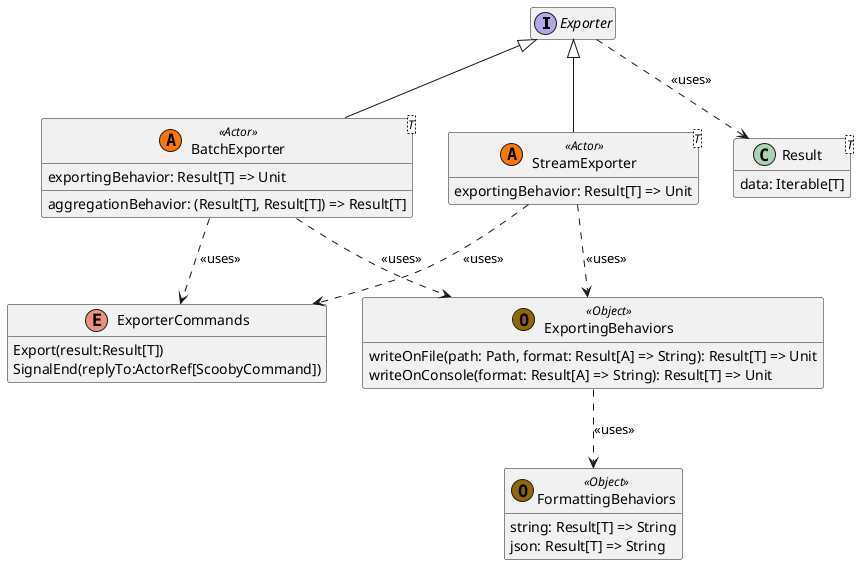

# Exporter

An **Exporter** is a system entity responsible for exporting the results obtained by scrapers. Exporters primarily
interact with the [Scrapers](Scraper.md), receiving results and exporting them according to a specific **Exporting
Behavior**. Each Scraper is aware of the available Exporters and forwards the results to them accordingly.

**Exporting Behaviors** define how the results should be processed (e.g., writing to a file, displaying on standard
output). Each Exporter is associated with a single Exporting Behavior, but multiple Exporters can handle the same
results in different ways.

Exporters are categorized into **Stream Exporters** and **Batch Exporters**.

## Stream Exporters

Stream Exporters operate in real-time, exporting results according to the specified exporting behavior as soon as they
become available. They work in a memory-less fashion, typically used to display results as they come in, without
persistence (e.g., standard output).

The interaction between Scrapers and Stream Exporters can be summarized as follows:

## Batch Exporters

Batch Exporters accumulate results and apply their Exporting Behavior only after the entire scraping process is
completed. Since they receive results from multiple scrapers and cannot process them immediately, they need a method to
**aggregate** the results. This is where **Aggregation Behavior** comes into play, defining how different results should
be combined. Like Exporting Behaviors, multiple default Aggregation Behaviors can be defined.

**Note:** In the case of Batch Exporters, they must interact with the system manager (_Scooby_) to determine when the
entire system execution has ended, allowing them to proceed with exporting the accumulated results.

The interaction between Scrapers and Batch Exporters can be summarized as follows:

## Structure

