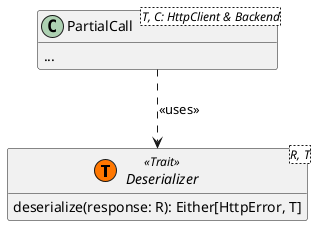

# Francesco Magnani

The primary areas where I've contributed on the implementation side include:

* [HTTP library](HTTP.md)
* [Document library](Document.md)
* Scooby's start/stop mechanisms
* DSL structure, scraper section, and safety mechanisms
* Scooby testing class

## HTTP library new API

After using the library in various scenarios, we noticed that the original usage could be cumbersome and verbose. To
address this, we designed and implemented a new API to provide a more flexible and concise usage, adopting a DSL-like 
approach (reported here as it is an implementation detail)

For example, the following code to make a simple GET request...

```Scala
val client = SimpleHttpClient()
val url = URL("www.example.com")
val request: Either[HttpError, Request] = Request.builder
    .get()
    .at(url)
    .headers(("Example-Header", "Value"))
    .build
val response: Either[HttpError, Response] = request match
    case Left(_) => ... // error in building the request
    case Right(req) => req.send(client)
val body: String = response match
    case Left(_) => ... // error in sending the request
    case Right(res) => res.body

val document = ScrapeDocument(body, url)
```

...has been simplified to this:

```Scala
given SimpleHttpClient = SimpleHttpClient()

val result: Either[HttpError, ScrapeDocument] = 
    GET("www.example.com") sending:
        Headers:
            Seq(("Example-Header", "Value"))
```

The new API relies on the **Deserializer** mechanism and the `PartialCall` class.



Using Scala's `Conversion` system, calls are automatically routed through a `given` Client with a `Backend` that works
with a specific response type. When a `Response` is received, a `given` deserializer converts
the `Either[HttpError, Response]` into `Either[HttpError, T]`, where `T` is inferred from the receiver variable's type (
e.g., a `ScrapeDocument`).

This mechanism simplifies and clarifies the library's usage while maintaining safety checks and error management.


### Scooby Start/Stop Mechanisms

The Scooby system utilizes the Akka actor system, making it crucial to manage the application's start and stop processes
gracefully. The stopping process, in particular, is challenging because it requires ensuring all actors have completed
their tasks and no longer need processing time.

To address this, we must understand the macro steps of execution and their interdependencies. A comprehensive
description of this management is available [here](Scooby-application-lifecycle.md).

### DSL Scraper Keywords

The scraping keywords consist of a single instruction, `scrape`, which opens a `Context` for defining the scraping
policy.

```Scala
/**
 * Top-level keyword for defining the scraping behavior.
 * @param block Definition of the scraping behavior
 * @param globalScope Global Scooby scope (e.g., "scooby: ...")
 * @tparam T Type of the result returned by this scraping behavior
 */
inline def scrape[T](block: ScrapeBehaviorScope[T])(using globalScope: ConfigurationWrapper[T]): Unit =
  catchRecursiveCtx[ScrapeDocument]("scrape")
  scrapeOp(block)

/**
 * Unsafe version of the one inside [[SafeOps]]
 * @param block Definition of the scraping behavior
 * @param globalScope Global Scooby scope (e.g., "scooby: ...")
 * @tparam T Type of the result returned by this scraping behavior
 */
def scrapeOp[T](block: ScrapeBehaviorScope[T])(using globalScope: ConfigurationWrapper[T]): Unit =
  globalScope.configuration = globalScope.configuration.focus(_.scraperConfiguration.scrapePolicy).replace:
    doc =>
      given ScrapeDocument = doc
      block
  
  globalScope.scrapingResultSetting = ScrapingResultSetting[T]()
```

Additional keywords can be used within this scope, depending on the type of data being scraped. Scraping policies can
return results of any Scala type, not just HTML elements (e.g., tuples and strings). However, since the target is
typically an HTML document, other keywords specifically facilitate working with HTML elements, offering a more
language-assisted customization of the scraping policy.

For example, in the following snippet:

```Scala
scrape:
    elements that haveId("exampleId")
```

Here, `that` is an alias for the Scala collection method `filter`, and `haveId` is a method that generates a predicate
for HTML elements, making the expression compile in Scala. These keywords are implemented as follows:

```Scala
def elements[D <: Document & CommonHTMLExplorer](using documentContext: D): Iterable[HTMLElement] =
    documentContext.getAllElements
    
extension [T](x: Iterable[T])
    inline infix def that(predicate: T => Boolean): Iterable[T] = x filter predicate
    
infix def haveId(id: String): HTMLElementRule = _.id == id
```

This approach is used throughout the DSL, making it highly customizable and enabling the creation of various useful
keywords.

### DSL Safety Mechanism

Using Scala, `given`s can be risky if misused. Keywords like `scrape` and `scooby` create scopes with a `given` context,
potentially allowing invalid programs to compile, such as with **nested repeated scopes**:

```Scala
scrape:
    scrape: 
        scrape:
            elements that haveId("exampleId")
```

While this program is invalid, detecting multiple nested `given`s in Scala can be tricky. For
instance, [ScalaTest](https://www.scalatest.org/) throws an exception at runtime if a `... should ... in` keyword is
nested incorrectly.

To address this, we instead use Scala 3 **macros**. Dangerous operators like `scrape` have a **safe version** (exposed outside
the DSL package) and an **unsafe** one (kept private). The safe version uses Scala `inline` methods
and `scala.compiletime` utilities to detect and prevent repeated `given`s at compile time.

The macro is implemented as follows:

```Scala
private inline def isInContext[T]: Boolean =
	summonFrom:
		case given T => true
		case _ => false
	

inline def catchRecursiveCtx[T](inline contextName: String): Unit =
	if isInContext[T] then error("\"" + contextName + "\" keyword cannot be placed inside another \"" + contextName + "\"")
```

### Scooby Testing Class

To facilitate DSL testing, a `ScoobyTest` class has been developed. This class contains methods that simulate Scooby
application behavior, making it easier to test various scenarios.