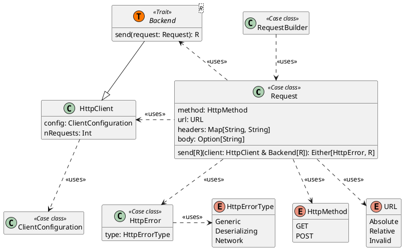

# HTTP Library

The [Crawler](Crawler.md) is a key component that needs to access web resources, necessitating a library for making HTTP
calls. To address this, we implemented an HTTP library that integrates several robust, pre-existing libraries.

Below is the general structure, presented in UML.

As described, `Crawlers` require a `ClientConfiguration` for the underlying HTTP client. Crawlers can use predefined
HTTP clients to share network resources or create their own if they are the root crawler.

Clients make HTTP calls using a `Backend`, which handles the actual logic of each HTTP call and typically wraps other
libraries internally. Each HTTP request uses the `Request` class to encapsulate the request information, but the
response type strictly depends on the `Backend` type. This design allows for multiple types of Backends, such as
synchronous (using a `Response` class) or asynchronous (using `Future[Response]`).

## New API and Deserializer Mechanism

This HTTP library has been reviewed, with a new API designed and implemented to improve usability. Since it focuses more
on implementation than design, a detailed description can be found [here](Francesco-Magnani.md#http-library-new-api).