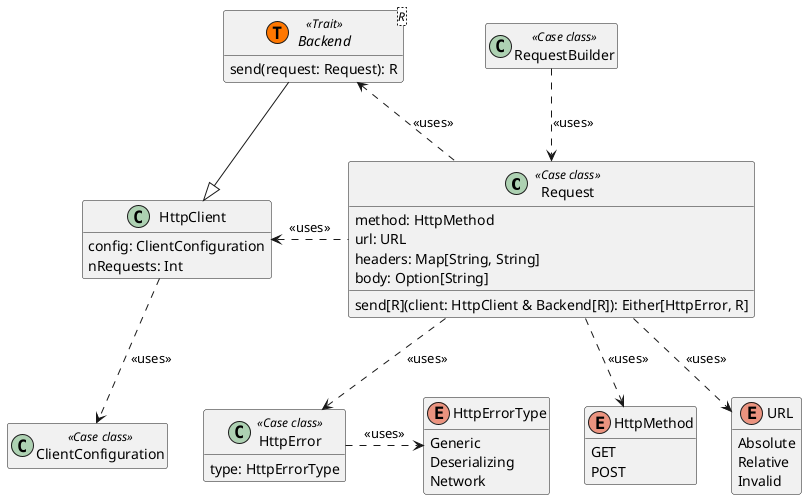
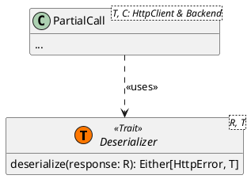

# HTTP Library

The [Crawler](Crawler.md) is a key component that needs to access web resources, necessitating a library for making HTTP
calls. To address this, we implemented an HTTP library that integrates several robust, pre-existing libraries.

Below is the general structure, presented in UML.



As described, `Crawlers` require a `ClientConfiguration` for the underlying HTTP client. Crawlers can use predefined
HTTP clients to share network resources or create their own if they are the root crawler.

Clients make HTTP calls using a `Backend`, which handles the actual logic of each HTTP call and typically wraps other
libraries internally. Each HTTP request uses the `Request` class to encapsulate the request information, but the
response type strictly depends on the `Backend` type. This design allows for multiple types of Backends, such as
synchronous (using a `Response` class) or asynchronous (using `Future[Response]`).

## New API and Deserializer Mechanism

After using the library in various scenarios, we noticed that the original usage could be cumbersome and verbose. To
address this, we designed a new API to provide a more flexible and concise usage, adopting a DSL-like approach.

For example, the following code to make a simple GET request...

```Scala
val client = SimpleHttpClient()
val url = URL("www.example.com")
val request: Either[HttpError, Request] = Request.builder
    .get()
    .at(url)
    .headers(("Example-Header", "Value"))
    .build
val response: Either[HttpError, Response] = request match
    case Left(_) => ... // error in building the request
    case Right(req) => req.send(client)
val body: String = response match
    case Left(_) => ... // error in sending the request
    case Right(res) => res.body

val document = ScrapeDocument(body, url)
```

...has been simplified to this:

```Scala
given SimpleHttpClient = SimpleHttpClient()

val result: Either[HttpError, ScrapeDocument] = 
    GET("www.example.com") sending:
        Headers:
            Seq(("Example-Header", "Value"))
```

The new API relies on the **Deserializer** mechanism and the `PartialCall` class.



Using Scala's `Conversion` system, calls are automatically routed through a `given` Client with a `Backend` that works
with a specific response type. When a `Response` is received, a `given` deserializer converts
the `Either[HttpError, Response]` into `Either[HttpError, T]`, where `T` is inferred from the receiver variable's type (
e.g., a `ScrapeDocument`).

This mechanism simplifies and clarifies the library's usage while maintaining safety checks and error management.