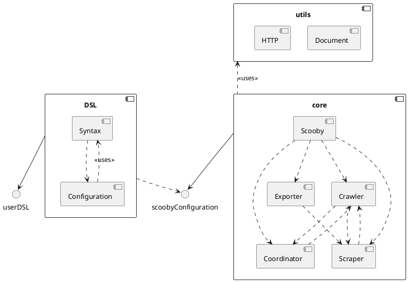
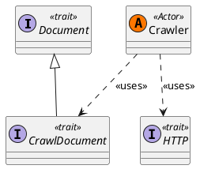
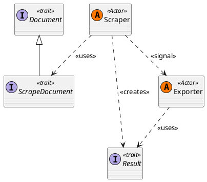
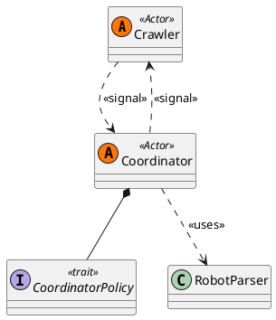
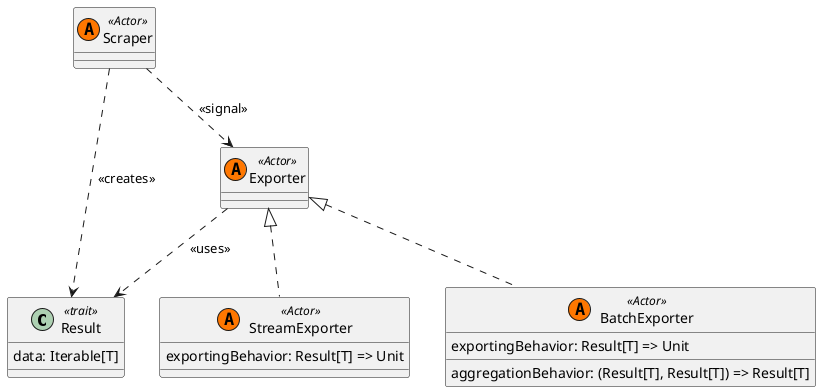

# In-Depth Design

## Project Structure
The structure of the project is divided into three principal components: the DSL, the core, and the utils:

- The **DSL** components manages the way the user configures the system using our custom internal domain-specific language.
- The **core** component is the heart of the system, containing the main entities and the logic to manage them.
- The **utils** component contains utility classes and functions.

# Components

## Core
The core package of the Scooby library contains the main entities that are involved in the scraping process. These are  the `Crawler`, `Scraper`, `Coordinator`, and `Exporter`. `Scooby` 
is the entity responsible for the system start-up and management.

### Crawler

A [Crawler](Crawler.md) is the actor responsible for searching and exploring links on web pages. It interacts with a coordinator to validate found URLs, creates [scrapers](Scraper.md) to extract data, and 
spawns new crawlers to explore new URLs.A is able to download the content of a web page using the [HTTP](HTTP.md) utility class and parse it with the [Document](Document.md) component of the `utils` package.

#### Crawler Messages
| Message | Description                                                                                                |
|---------|------------------------------------------------------------------------------------------------------------|
| `Crawl(url: URL)` | Start crawling a specific url.                                                                             |
| `CrawlerCoordinatorResponse(result: Iterator[URL])` | Receive a reponse from the coordinator. This message should be sent only by the Coordinator of the systekm |
| `ChildTerminated()` | Signal this crawler that one of it's sub-cralwer has terminated its computation.                           |

### Scraper
A [Scraper](Scraper.md) is an actor responsible for extracting data from a web page. It receives a document from a crawler, 
extracts the relevant information, and sends the results to an exporter.

#### Scraper Messages
| Message                                             | Description                                                              |
|-----------------------------------------------------|--------------------------------------------------------------------------|
| `Scrape(document: ScrapeDocument)`                  | Starts to scrape a specific document |

### Coordinator
The Coordinator is an actor that validates the URLs found by Crawlers. Usually the checks are based on a set of rules defined by the user, defining a 
policy that dictates which URLs are valid and which are not. Coordinators also control's if a url was already visited by a crawler and if it's allowed in the 
robot file of the website.

#### Coordinator Messages
| Message                                                                       | Description                                          |
|-------------------------------------------------------------------------------|------------------------------------------------------|
| `SetupRobots(url: URL)`                                                       | Parse and obtain rules for the robot file of the url |
| `CheckPages(pages: List[URL], replyTo: ActorRef[CrawlerCoordinatorResponse])` | Check the pages fetched by a Crawler                 |
| `SetCrawledPages()`                                                           | Set a predefined set of crawled page.                |
| `GetCrawledPages(replyTo: ActorRef[List[URL]])`                               | ???                                                  |
| `PagesChecked(result: Iterator[String])`                                      | ???                                                  |

### Exporter
The [Exporter](Exporter.md) is an actor responsible for exporting the scraped data. It receives the results from a [Scraper](Scraper.md) and exports them in a specific format.
Scooby supports two types of exporters: `StreamExporter` and `BatchExporter`. The former exports data as soon as it is scraped, while the latter aggregates the results and exports them all at once.
For both kind of exporters, is possible to define a behaviour that specify the format of the output and how to export it.

#### Exporter Messages
| Message | Description |
|---------|-------------|
| `Export(result: Result[T])` | Export the result of a scraping operation. |
| `SignalEnd(replyTo: ActorRef[ScoobyCommand])` | Signal the end of the export process. |