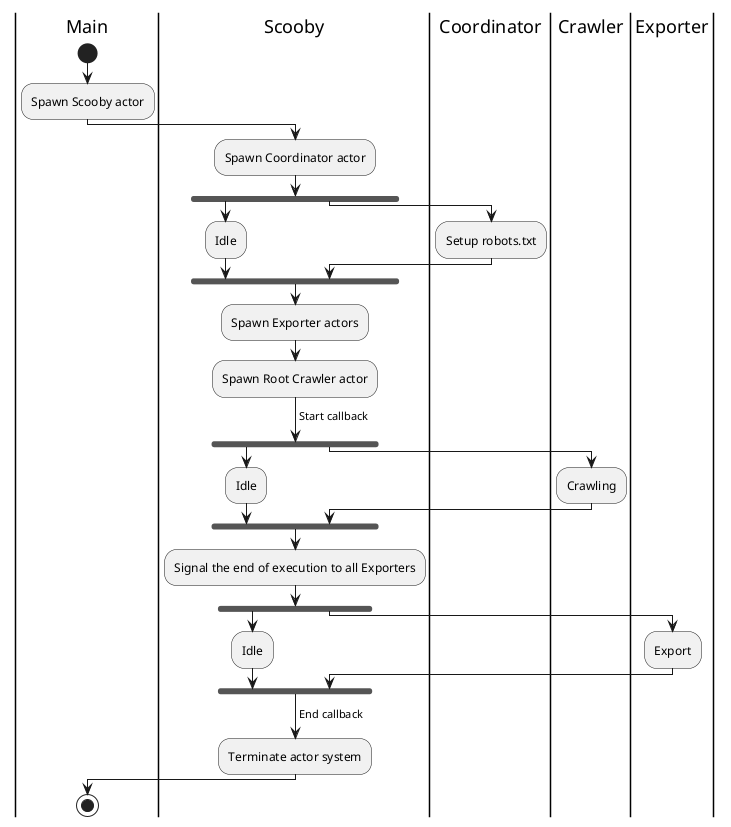
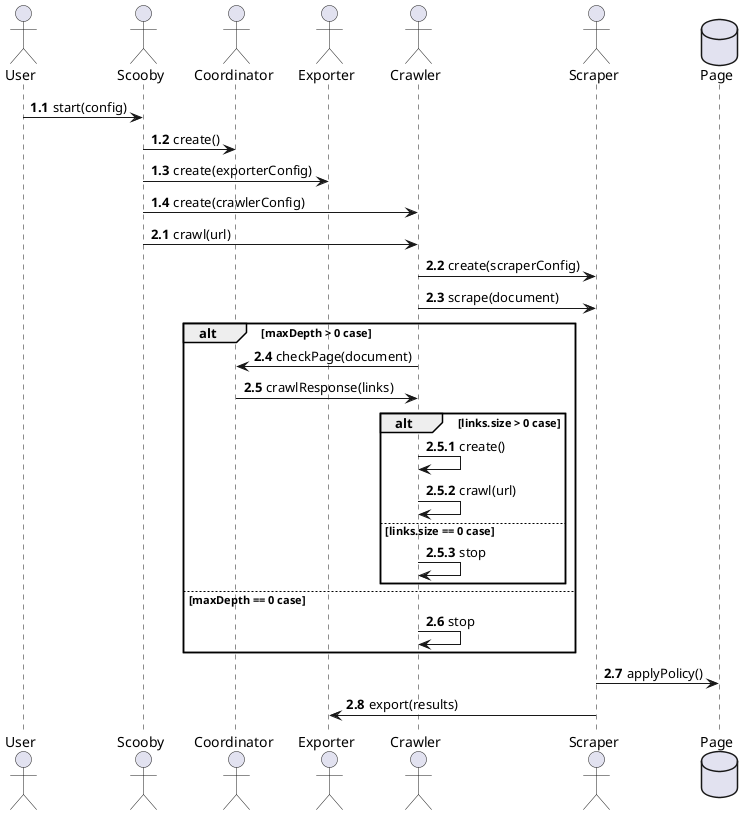

# Application Lifecycle

The Scooby application follows a specific sequence of steps that define its lifecycle. Understanding these steps is
crucial for interpreting the results and effectively using this library.

Below is a diagram illustrating the general structure:

Key points to note from this diagram are:

1. The `robots.txt` file must be managed before any other steps.
2. The system waits only for the Root Crawler to finish, ignoring other crawlers.
3. The system must wait for all Exporters to complete their execution.

While most steps are independent of each other, these three steps are blocking and must be completed before proceeding.
Managing these dependencies can be challenging, especially in an asynchronous Actor system.

## Robots.txt

Checking the `robots.txt` file is essential to comply with
the [Robot Exclusion Protocol](https://en.wikipedia.org/wiki/Robots.txt). This check is performed by the Coordinator
actor, and we must ensure that URL exclusion rules are applied before any Crawler requests URL validation. Thus,
checking `robots.txt` is a blocking step that must be completed before any Crawler is spawned and begins crawling.

For more details, see the Coordinator section.

## Crawler Tree

Why wait only for the Root Crawler? The system is designed so that a Crawler can finish its execution under one of four
conditions:

* No valid links to explore on the crawled page.
* It is a _leaf Crawler_ (i.e., it has reached the maximum crawling depth).
* All its child Crawlers have finished.
* An error occurred (e.g., network error).

This results in a **tree of Crawlers** exploring website pages. When the Root Crawler finishes, all other Crawlers will
have finished as well, indicating the end of the crawling process.

For more details, see the [Crawler section](Crawler.md).

## Exporter Termination

Especially for [Batch Exporters](Exporter.md#batch-exporters), notifying the end of the Crawling phase is crucial for
proper job completion. Since the number of Exporters varies, we must wait for all of them to ensure everything concludes
correctly. The Akka [ask pattern](https://doc.akka.io/docs/akka/current/stream/operators/Source-or-Flow/ask.html) is
useful for this purpose. Each Exporter, including [Stream Exporters](Exporter.md#stream-exporters), waits for a specific
message (called _SignalEnd_) to end their execution. Upon receiving this message, Stream Exporters simply terminate,
while Batch Exporters perform the final export. In both cases, Exporters reply to the Scooby actor once they're ready to
terminate.

The termination interaction occurs sequentially between the Scooby actor and each Exporter, ensuring one Exporter
finishes before the next begins. This approach is chosen for simplicity and to avoid conflicting export behaviors.

## Detailed interaction between actors

Here you can see a detailed diagram representing the interactions between actors.

