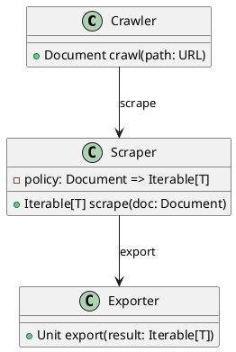

# Scraper uml

```plantuml
@startuml Scraper

class Crawler {
    + Document crawl(path: URL)
}

class Scraper {
    - policy: Document => Iterable[T]
    + Iterable[T] scrape(doc: Document)
}

class Exporter {
    + Unit export(result: Iterable[T])
}

Crawler --> Scraper: scrape
Scraper --> Exporter: export

@enduml

@startuml

frame "Application" {

    actor Scooby as scooby
    actor User as user
    actor Scraper as scraper
    actor Crawler as crawler
    actor SubCrawler as subCrawler
    actor Exporter as exporter
    actor Coordinator as coordinator
    
    rectangle "Page" as page

    user -right-> scooby : 1.1: start(config)

    scooby -right-> coordinator : 1.2: create()
    
    scooby -down-> exporter : 1.3: create(exporterConfig)

    scooby -down-> crawler : 1.4: create(crawlerConfig)
    
    scooby -down-> crawler : 1.5: crawl(url)
    
    crawler -down-> scraper : 1.6: create(scraperConfig)
    
    crawler -down-> scraper : 1.7: scrape(document)
    
    crawler --> coordinator : 1.8.1.a.1[maxDepth > 0] checkPage(document)
    
    coordinator --> crawler : 1.8.1.a.2 crawlResponse(links)
    
    crawler -left-> crawler : 1.8.1.b[maxDepth == 0] stop
    
    crawler --> subCrawler : 1.8.1.a.3.a.1[links.size > 0] create()
    
    crawler --> subCrawler : 1.8.1.a.3.a.2 crawl(url)
    
    crawler -right-> crawler : 1.8.1.a.3.b[links.size == 0] stop
    
    scraper --> exporter : 1.8.2 export(results)
    
}

@enduml

@startuml

frame "Scraper execution" {

    actor Scraper as scraper
    actor Crawler as crawler
    actor Exporter as exporter
    
    rectangle "Page" as page

    crawler -right-> scraper : 2.1: create(scraperConfig)
    
    crawler -right-> scraper : 2.2: scrape(document)
    
    scraper --> scraper : 2.3 applyPolicy(document)
    
    scraper --> exporter : 2.4 export(result)
    
    scraper --> scraper : 2.5 stop
    
}

@enduml
```