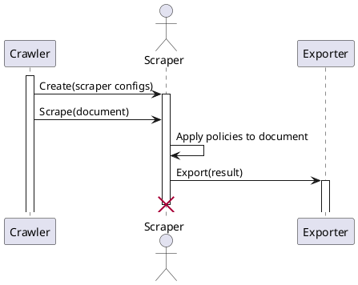
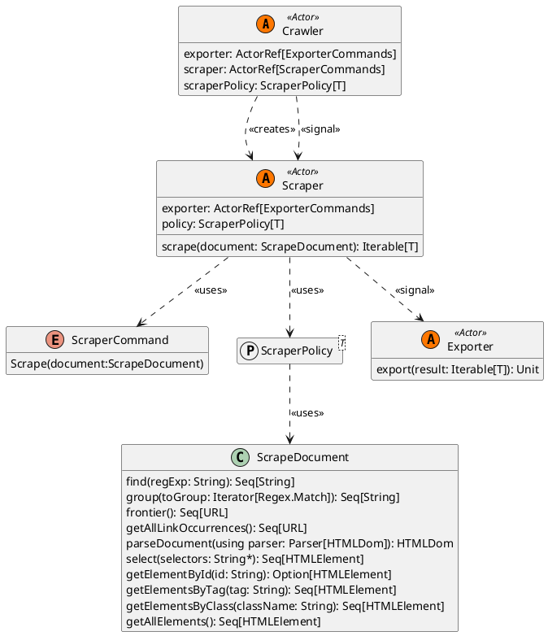

# Scraper

A scraper is a system entity tasked with analyzing page content to gather structured information.
Its work is triggered by the Crawler, which provides the document to scrape. Once its analysis is finished, it notifies
the Exporter with the result obtained and stops.

Interaction between other system entities can be depicted with the following diagram:

## Structure

## Scraper Policy

A Scraper Policy is the transformation that the Scraper applies to the page provided by Crawler to gather structured
information, which are then delivered to the Exporter entity.